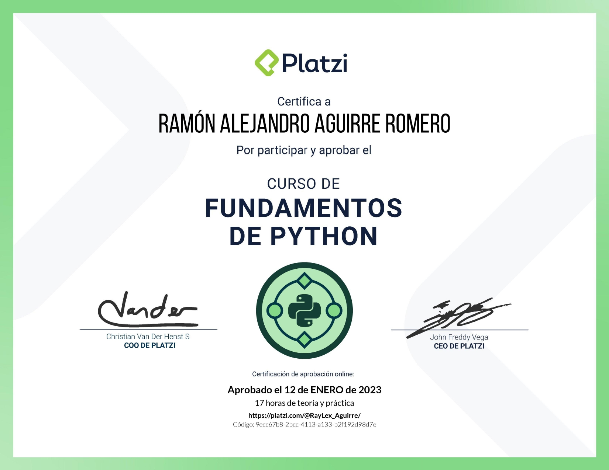

# Python Fundamentals Course

> <a href="https://platzi.com/cursos/python/?school=_escuela_escuela-datos_">Python Fundamentals Course</a>

Platzi professor: <a href="https://github.com/nicobytes">Nicolas Molina</a>

> Senior Web Developer with Angular and NestJS

Learn Python from scratch. Enhance your opportunities with this rapidly growing language for areas such as data science, backend development, artificial intelligence, IoT, and more. Create your first programs using variables, data structures, conditionals, and loops.

- Store data in lists and dictionaries for easy use
- Use conditionals and loops for program logic
- Learn different data types
- Apply various programming concepts

# Course Content

- First Steps with Python

1. Why learn Python?
2. Course tools
3. Tools for programming with Python
4. Your first program
5. Playgrounds: welcome to interactive exercises
6. Variables
7. Playgrounds: modify a variable's value

- Data Types in Python

1. Data types
2. Strings
3. Numbers
4. Booleans
5. Type transformation
6. Playgrounds: print the proper format

- Operators and Conditionals

1. Arithmetic operators
2. Comparison operators
3. Floating-point number comparison
4. Logical operators: and & or
5. Logical operator: not
6. Conditionals
7. Project: conditionals
8. Playgrounds: identify if a number is even or odd

- Lists and Dictionaries

1. Advanced strings
2. Indexing and slicing
3. Lists
4. List methods
5. Playgrounds: add, modify and remove list elements
6. Tuples
7. Project: tuples
8. Dictionaries: definition and reading
9. Dictionaries: insertion and updating
10. Playgrounds: add, modify and remove dictionary elements

- Loops

1. Loops: While
2. Loops: For
3. Playgrounds: add only positive numbers from a list
4. Nested loops

- Closure

1. Project: applying loops

> Certification: <a href="https://platzi.com/p/RayLex_Aguirre/curso/4227-python/diploma/detalle/">Show credential</a>

