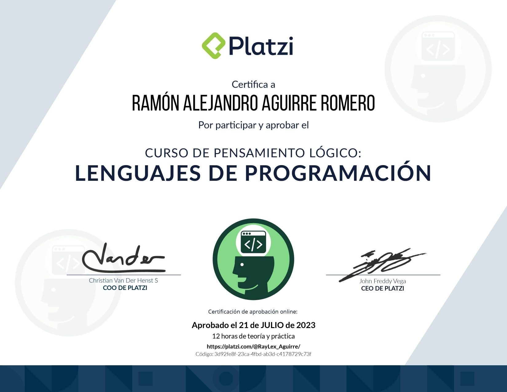

# Logical Thinking Course: Programming Languages

> <a href="https://platzi.com/cursos/pensamiento-logico-lenguajes/">Logical Thinking Course: Programming Languages</a>

Platzi professor: <a href="https://github.com/anabelisam">Ana Belisa Martínez</a>

> Faculty Manager for Computing and Technology

Take your first steps with the most popular programming languages of 2022: JavaScript, Python, and PHP. Write lines of code that your computer can understand and execute. Transform algorithms and flowcharts into real code alongside your professor Ana Belisa Martínez.

- Transform diagrams into real code
- Write your first lines of code
- Discover the main characteristics and differences between programming languages
- Create basic and complex algorithms with JavaScript, Python, and PHP

# Course Content

- Introduction to Programming Languages

1. What is a programming language? How to learn it?
2. What is the best programming language? Similarities and differences
3. Tools for programming: Replit

- JavaScript

1. What is JavaScript?
2. First steps with JavaScript
3. Challenge 9: translate an algorithm to JavaScript
4. Programming an algorithm with JavaScript

- Python

1. What is Python?
2. First steps with Python
3. Challenge 10: translate an algorithm to Python
4. Programming an algorithm with Python

- PHP

1. What is PHP?
2. First steps with PHP
3. Challenge 11: translate an algorithm to PHP
4. Programming an algorithm with PHP: arrays
5. Programming an algorithm with PHP: switch

- Next Steps

1. Take the Weekly Logical Thinking Challenges

Certification: <a href="https://platzi.com/p/RayLex_Aguirre/curso/3223-pensamiento-logico-lenguajes/diploma/detalle/">Show credential</a>

