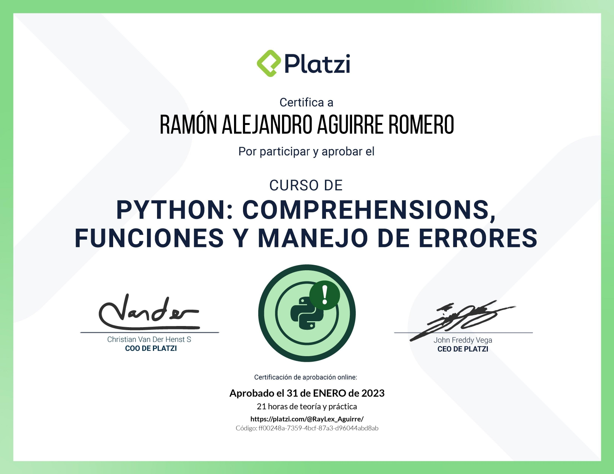

# Curso de Python: Comprehensions, Funciones y Manejo de Errores

> <a href="https://platzi.com/cursos/python-funciones/?school=_escuela_escuela-datos_">Curso de Python: Comprehensions, Funciones y Manejo de Errores</a>

Profesor en platzi: <a href="https://github.com/nicobytes">Nicolas Molina</a>

> Senior Web Developer con Angular y NestJS

Fortalece tus habilidades de programación con Python, uno de los lenguajes más utilizados. Aprende conceptos como funciones, comprehensions, errores y manejo de archivos que elevarán tu nivel al programar. Crea un gran proyecto junto a tu profesor Nicolas Molina.

- Crea y utiliza funciones y módulos para reutilizar código.
- Maneja archivos de texto con el context manager.
- Utiliza list y dictionary comprehensions, y high order functions.
- Aprende qué significan los errores y cómo manejarlos.

# Contenido del curso

- Introducción

1. El Zen de Python

- Conjuntos

1. Sets
2. Modificando conjuntos
3. Operaciones con conjuntos
4. Playgrounds: elimina elementos duplicados usando conjuntos

- Comprehensions

1. List Comprehension
2. Dictionary Comprehension
3. Dictionary Comprehension: condition
4. Playgrounds: crea una lista usando list comprehension
5. Lists vs. Tuples vs. Sets

- Funciones

1. Funciones
2. Funciones: return
3. Parámetros por defecto y múltiples returns
4. El scope
5. Refactor game
6. Playgrounds: tienda de tecnología
7. Funciones anónimas: lambda
8. Higher order function: una función dentro de otra función
9. Map
10. Map con diccionarios
11. Reto: map con inmutabilidad
12. Playgrounds: multiplica todos los elementos por dos
13. Filter
14. Playgrounds: retorna solo palabras de 4 letras y más
15. Reduce

- Módulos

1. Módulos
2. Mis propios módulos
3. Módulos como scripts: **name** y **main**
4. Paquetes
5. Playgrounds: calcular la suma de todas las compras

- Manipulación de archivos y errores

1. Iterables
2. Errores en Python
3. Manejo de excepciones
4. Playgrounds: captura la excepción: zerodivisionerror
5. Leer un archivo de texto
6. Escribir en un archivo
7. Leer un CSV
8. Playgrounds: lee un csv para calcular el total de gastos

- Gráficas en Python

1. Creando una gráfica
2. Reto: graficando la población de un país
3. Reto: graficando la población mundial

- Próximos pasos

1. Toma el Curso de PIP y Entornos Virtuales con Python
2. Comparte tu proyecto de python y certifícate

> Certificación: <a href="https://platzi.com/p/RayLex_Aguirre/curso/4260-course/diploma/detalle/">Mostrar credencial</a>

