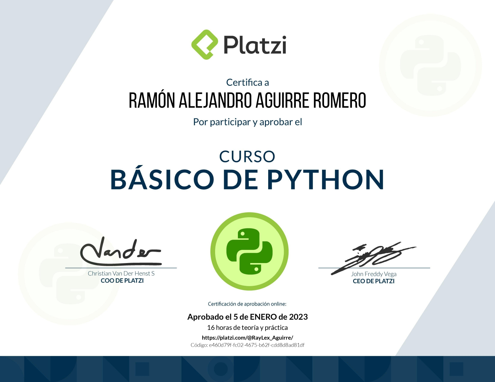

# Python-en-platzi

> <a href="https://platzi.com/cursos/python-basico/">Curso basico de python</a>

Profesor en casa de platzi: Facundo García Martoni

> Experto en Python, Frontend y Backend Engineer, Powerlifter

Aprende a programar desde cero con el lenguaje de mayor crecimiento en el planeta: Python. Descubre qué es un algoritmo y cómo se construye uno. Domina las variables, funciones, estructuras de datos, los condicionales y ciclos.

- Hacer estructuras de datos
- Crear bucles
- Conocer herramientas para programar
- Aprender conceptos básicos de Python

# Contenido del curso

- Introducción a la programación con Python

1. El arte de la programación
2. ¿Por qué aprender Python?
3. El núcleo de un programa: los algoritmos
4. Instalación de nuestras herramientas en Windows
5. Instalación de nuestras herramientas en Mac
6. Instalación de nuestras herramientas en Ubuntu
7. Tu mejor herramienta: la consola

- Conceptos básicos de Python

1. Explorando Python: operadores aritméticos
2. ¿Qué es una variable?
3. Los primitivos: tipos de datos sencillos
4. Convertir un dato a un tipo diferente
5. Operadores lógicos y de comparación en Python
6. Tu primer programa: conversor de monedas

- Herramientas para programar

1. Construyendo el camino de un programa con condicionales
2. Varios países en mi conversor de monedas
3. Aprendiendo a no repetir código con funciones
4. Modularizando nuestro conversor de monedas
5. Trabajando con texto: cadenas de caracteres
6. Trabajando con texto: slices
7. Proyecto: palíndromo

- Bucles

1. Aprendiendo bucles
2. El ciclo while
3. Explorando un bucle diferente: el ciclo for
4. Recorriendo un string con for
5. Interrumpiendo ciclos con break y continue
6. Proyecto: prueba de primalidad
7. Proyecto: videojuego

- Estructuras de datos

1. Almacenar varios valores en una variable: listas
2. Entendiendo cómo funcionan las tuplas
3. ¿Qué son los diccionarios?
4. Proyecto: generador de contraseñas

- Despedida

1. Sigue aprendiendo

Certificación: <a href="https://platzi.com/p/RayLex_Aguirre/curso/1937-python-basico/diploma/detalle/">Mostrar credencial</a>

